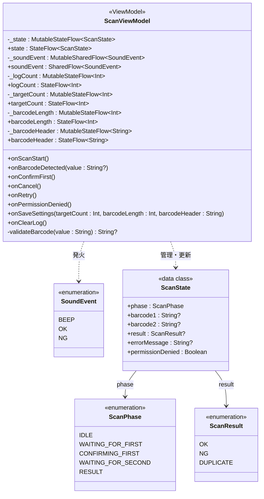
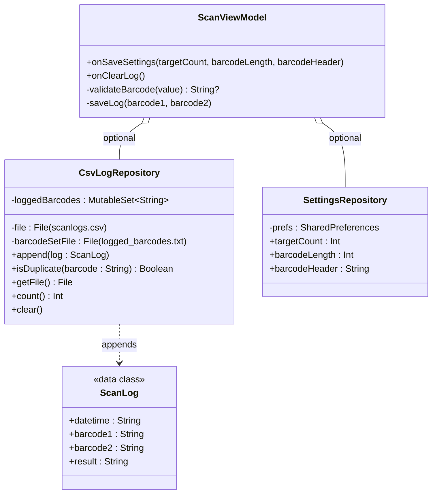

# CLASS.md — バーコード照合Androidアプリ クラス図

## レイヤー構成

```
UI層           MainActivity / StartScreen / ScanScreen / ResultScreen / CameraPreview
ViewModel層    ScanViewModel
Domain層       ScanState / ScanPhase / ScanResult / SoundEvent / ScanLog
Data層         CsvLogRepository / SettingsRepository
Camera層       BarcodeScannerController / BarcodeAnalyzer
Audio層        FeedbackSoundPlayer
```

---

## クラス図（全体）

```mermaid
classDiagram
    namespace domain {
        class ScanPhase {
            <<enumeration>>
            IDLE
            WAITING_FOR_FIRST
            CONFIRMING_FIRST
            WAITING_FOR_SECOND
            RESULT
        }

        class ScanResult {
            <<enumeration>>
            OK
            NG
            DUPLICATE
        }

        class SoundEvent {
            <<enumeration>>
            BEEP
            OK
            NG
        }

        class ScanState {
            <<data class>>
            +phase : ScanPhase
            +barcode1 : String?
            +barcode2 : String?
            +result : ScanResult?
            +errorMessage : String?
            +permissionDenied : Boolean
        }

        class ScanLog {
            <<data class>>
            +datetime : String
            +barcode1 : String
            +barcode2 : String
            +result : String
        }
    }

    namespace data {
        class CsvLogRepository {
            -file : File
            -barcodeSetFile : File
            -loggedBarcodes : MutableSet~String~
            +append(log : ScanLog)
            +isDuplicate(barcode : String) Boolean
            +getFile() File
            +count() Int
            +clear()
        }

        class SettingsRepository {
            -prefs : SharedPreferences
            +targetCount : Int
            +barcodeLength : Int
            +barcodeHeader : String
        }
    }

    namespace viewmodel {
        class ScanViewModel {
            <<ViewModel>>
            -_state : MutableStateFlow~ScanState~
            +state : StateFlow~ScanState~
            -_soundEvent : MutableSharedFlow~SoundEvent~
            +soundEvent : SharedFlow~SoundEvent~
            -_logCount : MutableStateFlow~Int~
            +logCount : StateFlow~Int~
            -_targetCount : MutableStateFlow~Int~
            +targetCount : StateFlow~Int~
            -_barcodeLength : MutableStateFlow~Int~
            +barcodeLength : StateFlow~Int~
            -_barcodeHeader : MutableStateFlow~String~
            +barcodeHeader : StateFlow~String~
            +onScanStart()
            +onBarcodeDetected(value : String?)
            +onConfirmFirst()
            +onCancel()
            +onRetry()
            +onPermissionDenied()
            +onSaveSettings(targetCount : Int, barcodeLength : Int, barcodeHeader : String)
            +onClearLog()
            -validateBarcode(value : String) String?
            -saveLog(barcode1 : String, barcode2 : String)
        }

        class ScanViewModelFactory {
            <<ViewModelProvider.Factory>>
            +create(modelClass : Class) ViewModel
        }
    }

    namespace camera {
        class BarcodeAnalyzer {
            <<ImageAnalysis.Analyzer>>
            -onDetected : (String?) -> Unit
            +analyze(image : ImageProxy)
        }

        class BarcodeScannerController {
            -analyzer : BarcodeAnalyzer
            -cameraProvider : ProcessCameraProvider?
            +startCamera(lifecycleOwner : LifecycleOwner, previewView : PreviewView)
            +stopCamera()
        }
    }

    namespace audio {
        class FeedbackSoundPlayer {
            -toneGenerator : ToneGenerator
            +play(event : SoundEvent)
            +release()
        }
    }

    namespace ui {
        class MainActivity {
            <<ComponentActivity>>
            +onCreate()
            -shareCsv(logRepo : CsvLogRepository)
        }

        class StartScreen {
            <<Composable>>
            +permissionDenied : Boolean
            +logCount : Int
            +targetCount : Int
            +barcodeLength : Int
            +barcodeHeader : String
            +versionName : String
            +onScanStart : () -> Unit
            +onDownloadCsv : () -> Unit
            +onClearLog : () -> Unit
            +onSaveSettings : (Int, Int, String) -> Unit
        }

        class ScanScreen {
            <<Composable>>
            +phase : ScanPhase
            +barcode1 : String?
            +errorMessage : String?
            +onCancel : () -> Unit
            +onConfirmFirst : () -> Unit
            +cameraContent : Composable
        }

        class ResultScreen {
            <<Composable>>
            +result : ScanResult
            +barcode1 : String?
            +barcode2 : String?
            +scannedCount : Int
            +targetCount : Int
            +onRetry : () -> Unit
            +onCancel : () -> Unit
        }

        class CameraPreview {
            <<Composable>>
            +controller : BarcodeScannerController
        }
    }

    %% Domain 内の関連
    ScanState --> ScanPhase : phase
    ScanState --> ScanResult : result (nullable)

    %% ViewModel ↔ Domain / Data
    ScanViewModel ..> ScanState : emits via StateFlow
    ScanViewModel ..> SoundEvent : emits via SharedFlow
    ScanViewModel o-- CsvLogRepository : uses (optional)
    ScanViewModel o-- SettingsRepository : uses (optional)
    ScanViewModelFactory ..> ScanViewModel : creates

    %% Camera層
    BarcodeScannerController *-- BarcodeAnalyzer : owns
    BarcodeAnalyzer ..> ScanViewModel : onBarcodeDetected()

    %% Audio層
    MainActivity *-- FeedbackSoundPlayer : creates / releases

    %% MainActivity ↔ ViewModel
    MainActivity o-- ScanViewModel : observes state
    MainActivity ..> FeedbackSoundPlayer : calls on SoundEvent
    MainActivity ..> CsvLogRepository : creates / passes to VM

    %% UI ↔ ViewModel / Controller
    ScanScreen *-- CameraPreview : contains
    ResultScreen ..> ScanResult : observes

    %% MainActivity → 画面
    MainActivity ..> StartScreen : renders
    MainActivity ..> ScanScreen : renders
    MainActivity ..> ResultScreen : renders
```



---

## クラス図（Domain + ViewModel 詳細）



---

## クラス図（Data 層詳細）



---

## クラス一覧

### Domain層

| クラス | 種別 | 役割 |
|--------|------|------|
| `ScanPhase` | enum | 読み取りフェーズ（IDLE / WAITING_FOR_FIRST / CONFIRMING_FIRST / WAITING_FOR_SECOND / RESULT） |
| `ScanResult` | enum | 照合結果（OK / NG / DUPLICATE） |
| `SoundEvent` | enum | 音イベント（BEEP / OK / NG）。ViewModel が発火し MainActivity が受け取る |
| `ScanState` | data class | 画面全体の状態スナップショット。StateFlow で UI に流す |
| `ScanLog` | data class | CSVへ書き出す1レコード分のデータ |

### Data層

| クラス | 種別 | 役割 |
|--------|------|------|
| `CsvLogRepository` | 通常クラス | OKログのCSV追記・重複チェック用バーコードセット管理・クリア |
| `SettingsRepository` | 通常クラス | SharedPreferences で目標件数・バーコード長・ヘッダーを永続化 |

### ViewModel層

| クラス | 種別 | 役割 |
|--------|------|------|
| `ScanViewModel` | ViewModel | 状態管理・照合ロジック・バーコードバリデーション・重複判定・件数管理。logRepo/settingsRepo は省略可能（テスト時は null） |
| `ScanViewModelFactory` | ViewModelProvider.Factory | logRepo・settingsRepo を ScanViewModel コンストラクタに渡す |

### Camera層

| クラス | 種別 | 役割 |
|--------|------|------|
| `BarcodeAnalyzer` | ImageAnalysis.Analyzer | ML Kit で全フォーマットのバーコードを検出し、コールバックで ViewModel に通知する |
| `BarcodeScannerController` | 通常クラス | CameraX の起動・停止と BarcodeAnalyzer のバインドを担う |

### Audio層

| クラス | 種別 | 役割 |
|--------|------|------|
| `FeedbackSoundPlayer` | 通常クラス | ToneGenerator を内部管理し、SoundEvent に応じた音を再生する |

### UI層

| クラス | 種別 | 役割 |
|--------|------|------|
| `MainActivity` | ComponentActivity | ViewModel・FeedbackSoundPlayer・リポジトリを保持し、SoundEvent 観察・CSV 共有を担う |
| `StartScreen` | Composable | スタート画面。進捗表示・設定ダイアログ（読み込み数・バーコード長・ヘッダー）・ログメニュー・バージョン表示 |
| `ScanScreen` | Composable | 読み取り画面。CameraPreview を内包し、CONFIRMING_FIRST 時に確認UIを表示 |
| `ResultScreen` | Composable | 判定画面。OK（青）/ NG（赤）/ 重複（橙）表示と進捗・完了メッセージ |
| `CameraPreview` | Composable | CameraX のプレビューを AndroidView でラップして表示する |
