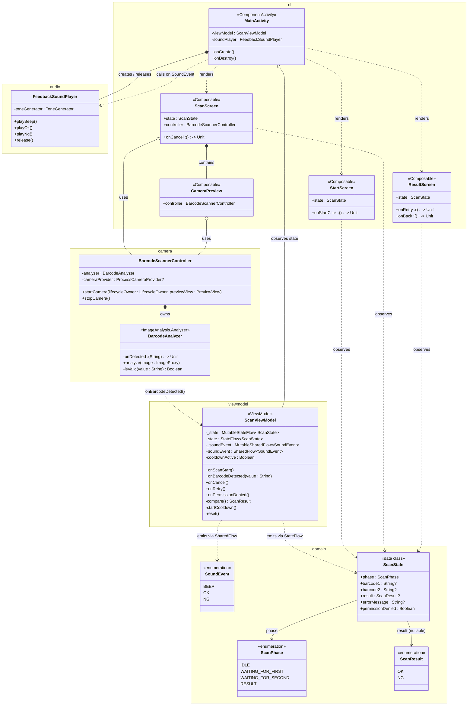
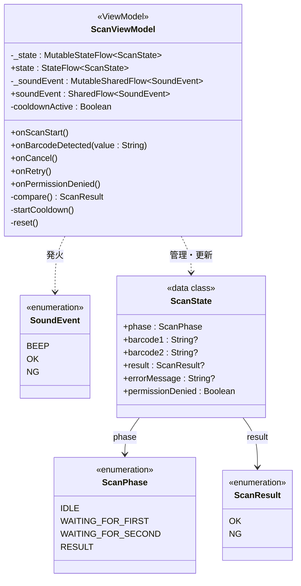
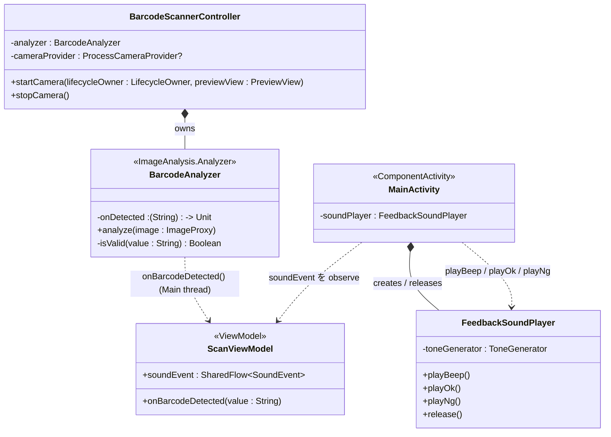

# CLASS.md — バーコード照合Androidアプリ クラス図

## レイヤー構成

```
UI層           MainActivity / StartScreen / ScanScreen / ResultScreen / CameraPreview
ViewModel層    ScanViewModel
Domain層       ScanState / ScanPhase / ScanResult / SoundEvent
Camera層       BarcodeScannerController / BarcodeAnalyzer
Audio層        FeedbackSoundPlayer
```

---

## クラス図（全体）



---

## クラス図（Domain + ViewModel 詳細）

状態遷移の核となる部分を抜き出した詳細図。



---

## クラス図（Camera + Audio 詳細）



---

## クラス一覧

### Domain層

| クラス | 種別 | 役割 |
|--------|------|------|
| `ScanPhase` | enum | 読み取りフェーズ（IDLE / WAITING_FOR_FIRST / WAITING_FOR_SECOND / RESULT） |
| `ScanResult` | enum | 照合結果（OK / NG） |
| `SoundEvent` | enum | 音イベント（BEEP / OK / NG）。ViewModel が発火し MainActivity が受け取る |
| `ScanState` | data class | 画面全体の状態スナップショット。StateFlow で UI に流す |

### ViewModel層

| クラス | 種別 | 役割 |
|--------|------|------|
| `ScanViewModel` | ViewModel | 状態管理・照合ロジック・クールダウン制御。Android 依存を持たない |

### Camera層

| クラス | 種別 | 役割 |
|--------|------|------|
| `BarcodeAnalyzer` | ImageAnalysis.Analyzer | ML Kit でバーコードを検出し、コールバックで ViewModel に通知する |
| `BarcodeScannerController` | 通常クラス | CameraX の起動・停止と BarcodeAnalyzer のバインドを担う |

### Audio層

| クラス | 種別 | 役割 |
|--------|------|------|
| `FeedbackSoundPlayer` | 通常クラス | ToneGenerator を内部管理し、3種の音を再生する |

### UI層

| クラス | 種別 | 役割 |
|--------|------|------|
| `MainActivity` | ComponentActivity | ViewModel・FeedbackSoundPlayer を保持し、SoundEvent を観察して音を鳴らす |
| `StartScreen` | Composable | スタート画面。ボタン押下で onStartClick を呼ぶ |
| `ScanScreen` | Composable | 読み取り画面。CameraPreview を内包し、フェーズ文言を表示する |
| `ResultScreen` | Composable | 判定画面。OK/NG 表示と「もう一度」「戻る」ボタンを持つ |
| `CameraPreview` | Composable | CameraX のプレビューを AndroidView でラップして表示する |
