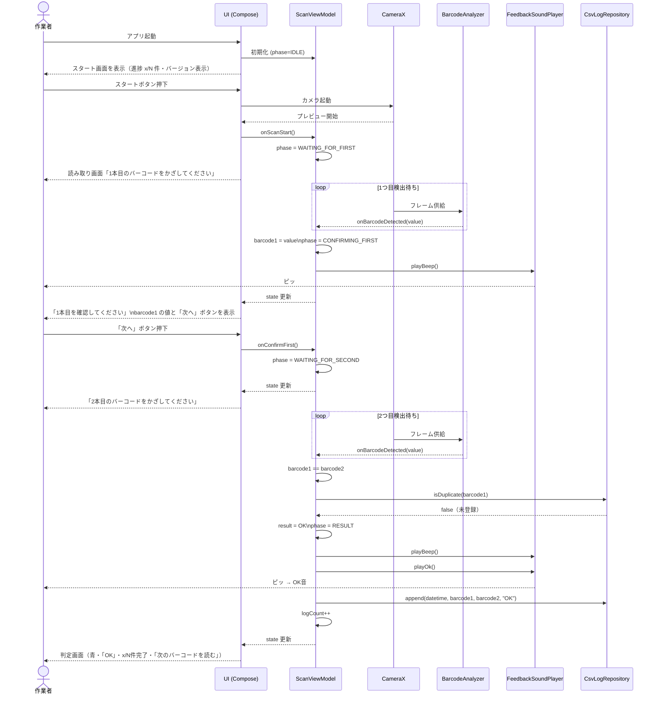
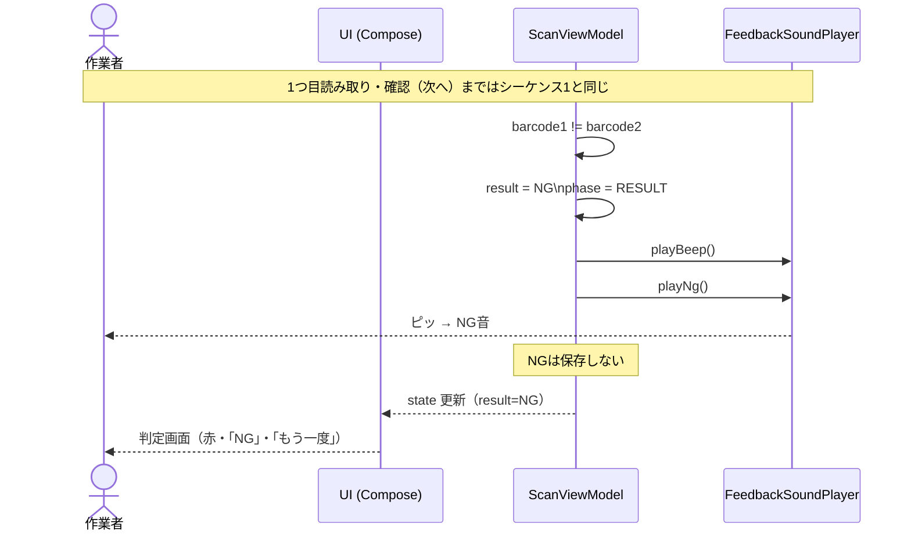
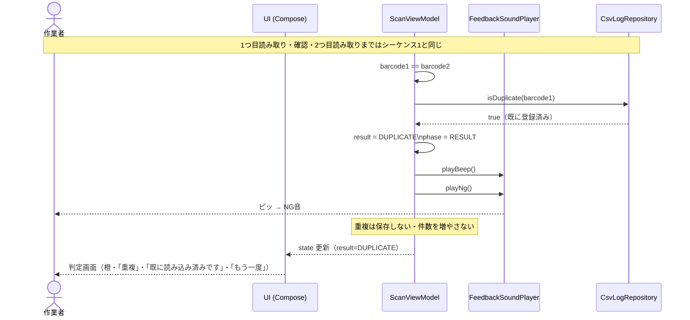
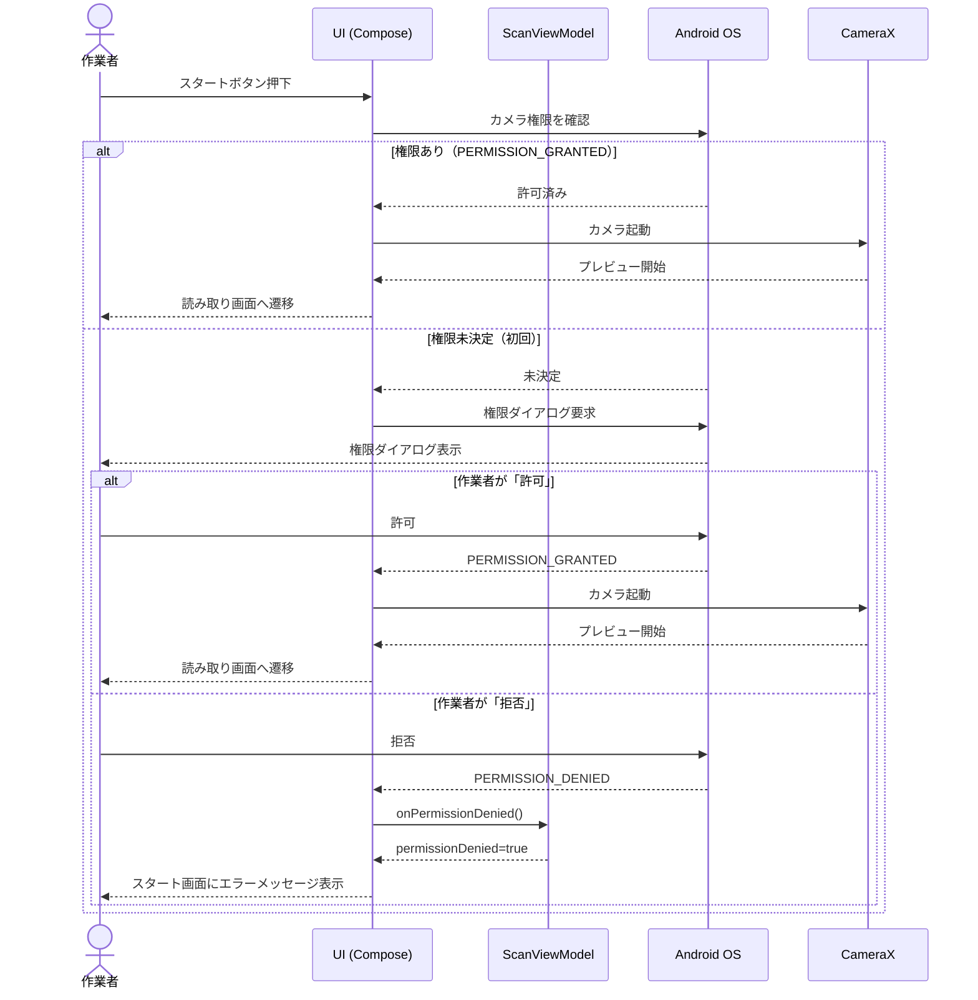
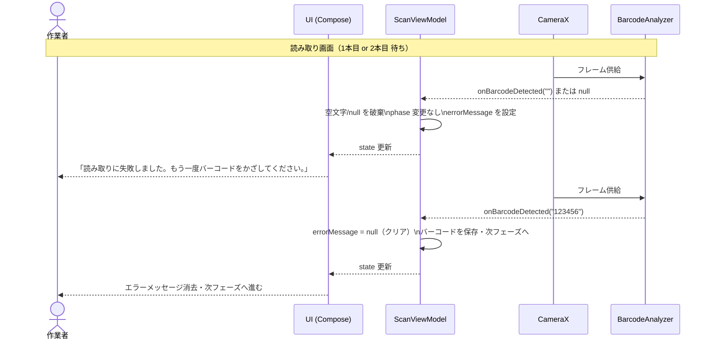
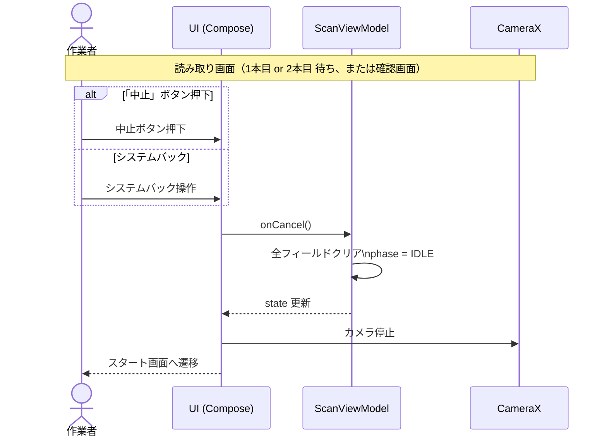
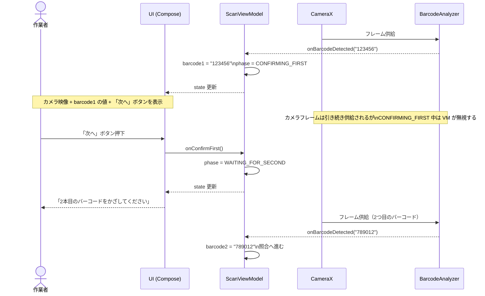
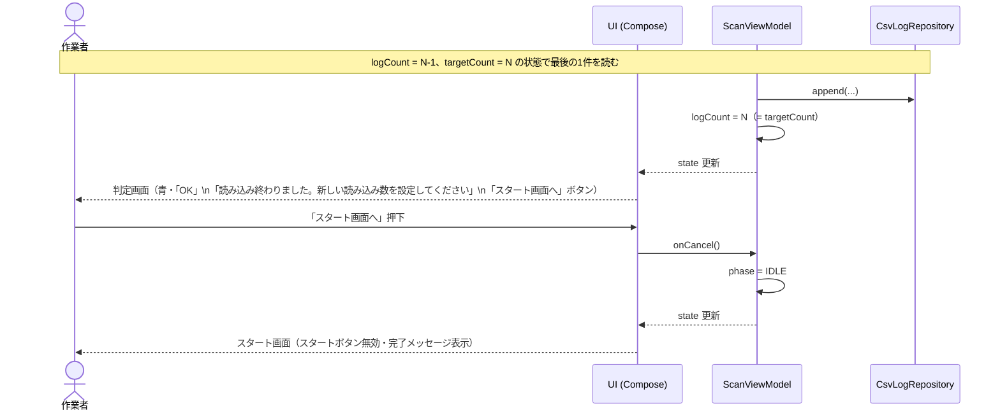

# SEQUENCE.md — バーコード照合Androidアプリ シーケンス図

## 登場人物

| 略称 | 名称 | 役割 |
|------|------|------|
| User | 作業者 | アプリを操作する現場担当者 |
| UI | UI (Compose) | 画面描画・ユーザー操作受付 |
| VM | ScanViewModel | 状態管理・照合ロジック |
| Camera | CameraX | カメラプレビュー・フレーム供給 |
| BA | BarcodeAnalyzer (ML Kit) | バーコード検出 |
| Sound | FeedbackSoundPlayer | 音声フィードバック |
| Log | CsvLogRepository | CSV保存・重複チェック |
| OS | Android OS | 権限管理 |

---

## シーケンス 1: 正常フロー（OK・重複なし）

---

## シーケンス 2: 正常フロー（NG判定）

---

## シーケンス 3: 重複検出フロー

---

## シーケンス 4: カメラ権限フロー

---

## シーケンス 5: 空文字・null 読み取り時の対応

---

## シーケンス 6: 読み取り中止フロー

---

## シーケンス 7: 1本目確認フロー（CONFIRMING_FIRST）

---

## シーケンス 8: 読み込み数完了フロー

