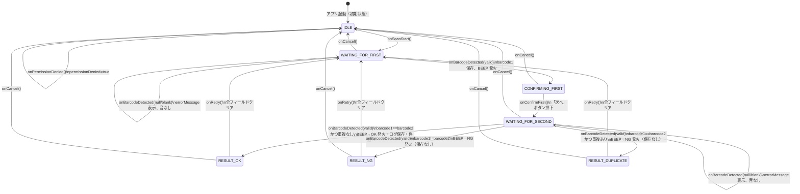

# TESTCASE.md — バーコード照合Androidアプリ テストケース

## テスト方針

| 種別 | 対象 | 実施有無 |
|------|------|---------|
| Unit テスト | ScanViewModel | ✅ 必須 |
| Unit テスト | BarcodeAnalyzer | ❌ 今回対象外（ML Kit / ImageProxy 依存が強いため）|
| Unit テスト | FeedbackSoundPlayer | ❌ 今回対象外（ToneGenerator はモック化困難） |
| Unit テスト | CsvLogRepository（重複・件数） | ❌ 今回対象外（Context 依存のため Robolectric が必要） |
| 手動確認 | 各種バーコードフォーマット読み取り | ✅ 必須 |
| 手動確認 | 重複検出・読み込み数完了 | ✅ 必須 |
| UI テスト（Compose） | 各画面 | ❌ 今回対象外 |
| Instrumented テスト | CameraX + ML Kit 結合 | ❌ 今回対象外 |

---

## 状態遷移テストマトリクス



---

## TC-VM: ScanViewModel Unit テスト（30件）

### 初期状態

| ID | テスト名 | 前提条件 | 操作 | 期待結果 |
|----|---------|---------|------|---------|
| TC-VM-001 | 初期状態の確認 | — | `ScanViewModel()` 生成 | `phase=IDLE`, `barcode1=null`, `barcode2=null`, `result=null`, `errorMessage=null`, `permissionDenied=false` |

---

### フェーズ遷移

| ID | テスト名 | 前提条件 | 操作 | 期待結果 |
|----|---------|---------|------|---------|
| TC-VM-002 | onScanStart() で WAITING_FOR_FIRST へ | `phase=IDLE` | `onScanStart()` | `phase=WAITING_FOR_FIRST` |
| TC-VM-003 | 1つ目有効読み取りで CONFIRMING_FIRST へ | `phase=WAITING_FOR_FIRST` | `onBarcodeDetected("ABC")` | `barcode1="ABC"`, `phase=CONFIRMING_FIRST` |
| TC-VM-004 | 2つ目有効読み取りで RESULT へ（一致・logRepo=null のため重複なし扱い） | `barcode1="ABC"`, `phase=WAITING_FOR_SECOND` | `onBarcodeDetected("ABC")` | `barcode2="ABC"`, `result=OK`, `phase=RESULT` |
| TC-VM-005 | 2つ目有効読み取りで RESULT へ（不一致） | `barcode1="ABC"`, `phase=WAITING_FOR_SECOND` | `onBarcodeDetected("XYZ")` | `barcode2="XYZ"`, `result=NG`, `phase=RESULT` |
| TC-VM-006 | onRetry() で WAITING_FOR_FIRST へ | `phase=RESULT`, `result=OK` | `onRetry()` | `phase=WAITING_FOR_FIRST`, `barcode1=null`, `barcode2=null`, `result=null` |
| TC-VM-007 | onCancel() で IDLE へ（読み取り中） | `barcode1="ABC"`, `phase=CONFIRMING_FIRST` | `onCancel()` | `phase=IDLE`, 全フィールド null |
| TC-VM-008 | onCancel() で IDLE へ（判定後） | `phase=RESULT`, `result=NG` | `onCancel()` | `phase=IDLE`, 全フィールド null |
| TC-VM-011 | 同じ値を意図的に2回読める（logRepo=null のため重複判定なし） | `phase=WAITING_FOR_FIRST` | `onBarcodeDetected("SAME")` → `onConfirmFirst()` → `onBarcodeDetected("SAME")` | `result=OK` |
| TC-VM-027 | onConfirmFirst() で WAITING_FOR_SECOND へ | `phase=CONFIRMING_FIRST` | `onConfirmFirst()` | `phase=WAITING_FOR_SECOND` |
| TC-VM-028 | onConfirmFirst() を CONFIRMING_FIRST 以外で呼んでも無視 | `phase=WAITING_FOR_FIRST` | `onConfirmFirst()` | `phase=WAITING_FOR_FIRST`（変化なし） |

---

### 空文字 / null 読み取り

| ID | テスト名 | 前提条件 | 操作 | 期待結果 |
|----|---------|---------|------|---------|
| TC-VM-012 | null 読み取りでフェーズ維持 | `phase=WAITING_FOR_FIRST` | `onBarcodeDetected(null)` | `barcode1=null`, `phase=WAITING_FOR_FIRST`, `errorMessage` が設定される |
| TC-VM-013 | 空文字読み取りでフェーズ維持 | `phase=WAITING_FOR_FIRST` | `onBarcodeDetected("")` | `barcode1=null`, `phase=WAITING_FOR_FIRST`, `errorMessage` が設定される |
| TC-VM-014 | 空白文字列読み取りでフェーズ維持 | `phase=WAITING_FOR_FIRST` | `onBarcodeDetected("   ")` | `barcode1=null`, `phase=WAITING_FOR_FIRST`, `errorMessage` が設定される |
| TC-VM-015 | 2つ目フェーズでの null 読み取りもフェーズ維持 | `barcode1="ABC"`, `phase=WAITING_FOR_SECOND` | `onBarcodeDetected(null)` | `barcode2=null`, `phase=WAITING_FOR_SECOND`, `errorMessage` が設定される |
| TC-VM-016 | 有効読み取りで errorMessage がクリアされる | `errorMessage="読み取りに失敗しました..."` | `onBarcodeDetected("ABC")` | `errorMessage=null` |

---

### SoundEvent 発火

| ID | テスト名 | 前提条件 | 操作 | 期待結果 |
|----|---------|---------|------|---------|
| TC-VM-017 | 1つ目有効読み取りで BEEP 発火 | `phase=WAITING_FOR_FIRST` | `onBarcodeDetected("ABC")` | `SoundEvent.BEEP` が emit される |
| TC-VM-018 | OK判定で BEEP → OK の順で発火 | `barcode1="ABC"`, `phase=WAITING_FOR_SECOND` | `onConfirmFirst()` → `onBarcodeDetected("ABC")` | `[BEEP, BEEP, OK]` の順で emit |
| TC-VM-019 | NG判定で BEEP → NG の順で発火 | `barcode1="ABC"`, `phase=WAITING_FOR_SECOND` | `onConfirmFirst()` → `onBarcodeDetected("XYZ")` | `[BEEP, BEEP, NG]` の順で emit |
| TC-VM-020 | null 読み取りで SoundEvent を発火しない | `phase=WAITING_FOR_FIRST` | `onBarcodeDetected(null)` | `SoundEvent` が emit されない |

---

### 権限・IDLE 状態での入力ガード

| ID | テスト名 | 前提条件 | 操作 | 期待結果 |
|----|---------|---------|------|---------|
| TC-VM-021 | onPermissionDenied() で permissionDenied=true | — | `onPermissionDenied()` | `permissionDenied=true`, `phase=IDLE` |
| TC-VM-022 | IDLE 中の onBarcodeDetected は無視 | `phase=IDLE` | `onBarcodeDetected("ABC")` | `phase=IDLE`, `barcode1=null`（変化なし） |
| TC-VM-023 | RESULT 中の onBarcodeDetected は無視 | `phase=RESULT` | `onBarcodeDetected("ABC")` | `phase=RESULT`（変化なし） |
| TC-VM-024 | onScanStart() で permissionDenied がクリアされる | `permissionDenied=true` | `onScanStart()` | `permissionDenied=false`, `phase=WAITING_FOR_FIRST` |
| TC-VM-025 | onCancel() で permissionDenied がクリアされる | `permissionDenied=true` | `onCancel()` | `permissionDenied=false`, `phase=IDLE` |
| TC-VM-026 | 権限拒否後に再拒否すると再び permissionDenied=true | `permissionDenied=true` | `onScanStart()` → `onPermissionDenied()` | `permissionDenied=true`, `phase=IDLE` |

---

### 読み込み数設定

| ID | テスト名 | 前提条件 | 操作 | 期待結果 |
|----|---------|---------|------|---------|
| TC-VM-029 | 初期 targetCount は 0 | — | `ScanViewModel()` 生成 | `targetCount.value == 0` |
| TC-VM-030 | onSetTargetCount() で targetCount が更新される | `targetCount=0` | `onSetTargetCount(100)` | `targetCount.value == 100` |

---

## TC-ST: 状態遷移の網羅テスト

| 現在フェーズ | イベント | 期待フェーズ | 備考 |
|-------------|---------|------------|------|
| IDLE | `onScanStart()` | WAITING_FOR_FIRST | — |
| IDLE | `onBarcodeDetected(valid)` | IDLE | 無視 |
| IDLE | `onCancel()` | IDLE | 変化なし |
| IDLE | `onPermissionDenied()` | IDLE | permissionDenied=true |
| WAITING_FOR_FIRST | `onBarcodeDetected(valid)` | CONFIRMING_FIRST | barcode1 保存、BEEP 発火 |
| WAITING_FOR_FIRST | `onBarcodeDetected(null)` | WAITING_FOR_FIRST | errorMessage 設定 |
| WAITING_FOR_FIRST | `onCancel()` | IDLE | 全クリア |
| CONFIRMING_FIRST | `onConfirmFirst()` | WAITING_FOR_SECOND | 「次へ」ボタン押下時 |
| CONFIRMING_FIRST | `onCancel()` | IDLE | 全クリア |
| CONFIRMING_FIRST | `onBarcodeDetected(valid)` | CONFIRMING_FIRST | 無視（フェーズガード） |
| WAITING_FOR_SECOND | `onBarcodeDetected(valid)` 一致・重複なし | RESULT | result=OK、ログ保存、件数+1 |
| WAITING_FOR_SECOND | `onBarcodeDetected(valid)` 不一致 | RESULT | result=NG、保存なし |
| WAITING_FOR_SECOND | `onBarcodeDetected(valid)` 一致・重複あり | RESULT | result=DUPLICATE、保存なし |
| WAITING_FOR_SECOND | `onBarcodeDetected(null)` | WAITING_FOR_SECOND | errorMessage 設定 |
| WAITING_FOR_SECOND | `onCancel()` | IDLE | 全クリア |
| RESULT | `onRetry()` | WAITING_FOR_FIRST | 全クリア |
| RESULT | `onCancel()` | IDLE | 全クリア |
| RESULT | `onBarcodeDetected(valid)` | RESULT | 無視 |

---

## テスト実装メモ

### セットアップ：MainDispatcherRule

```kotlin
@OptIn(ExperimentalCoroutinesApi::class)
class MainDispatcherRule(
    val testDispatcher: TestDispatcher = StandardTestDispatcher()
) : TestWatcher() {
    override fun starting(description: Description) { Dispatchers.setMain(testDispatcher) }
    override fun finished(description: Description) { Dispatchers.resetMain() }
}
```

### logRepo=null 時の挙動

`ScanViewModel()` を引数なしで生成すると `logRepo=null`・`settingsRepo=null` になる。
この場合 `isDuplicate()` は呼ばれず（常に false 扱い）、`saveLog()` は何もしない。
既存のユニットテストはすべてこの状態で動作する。

### 2スキャンフロー（OK）

```kotlin
vm.onScanStart(); runCurrent()
vm.onBarcodeDetected("ABC"); runCurrent()  // → CONFIRMING_FIRST
vm.onConfirmFirst(); runCurrent()           // → WAITING_FOR_SECOND
vm.onBarcodeDetected("ABC"); runCurrent()  // → RESULT (OK)
assertEquals(ScanResult.OK, vm.state.value.result)
```

### SoundEvent の収集方法

```kotlin
val events = mutableListOf<SoundEvent>()
val job = launch { vm.soundEvent.collect { events.add(it) } }
// ... 操作 ...
assertEquals(listOf(SoundEvent.BEEP, SoundEvent.BEEP, SoundEvent.OK), events)
job.cancel()
```

---

## 受け入れ条件との対応

| 受け入れ条件 | 対応テストケース |
|-------------|----------------|
| APKでインストールできる | 手動確認 |
| スタートボタンでカメラ起動 | 手動確認 |
| 1つ目読み取り後に値と「次へ」表示 | TC-VM-003, TC-VM-027 + 手動確認 |
| 「次へ」押下で2つ目へ進む | TC-VM-027 |
| 一致時 OK（青）表示 | TC-VM-004 + 手動確認 |
| 不一致時 NG（赤）表示 | TC-VM-005 + 手動確認 |
| 重複時 重複（橙）表示・件数増やさない | 手動確認（logRepo=Context 依存） |
| OKのみCSV保存・NGと重複は保存しない | 手動確認 |
| 読み込み数設定・進捗 x/N 件表示 | TC-VM-029, TC-VM-030 + 手動確認 |
| 目標完了でスタート無効・完了メッセージ | 手動確認 |
| 読み取り時に音が鳴る | TC-VM-017〜TC-VM-019 |
| 判定時に OK/NG 音が鳴る | TC-VM-018, TC-VM-019 |
| OK ボタン「次のバーコードを読む」 | 手動確認 |
| NG・重複ボタン「もう一度」 | 手動確認 |
| 「もう一度」で再読み取りへ | TC-VM-006 |
| 「中止」でスタート画面へ | TC-VM-007 + 手動確認 |
| ログクリアで重複セットもリセット | 手動確認 |
| CSVをダウンロード（共有シート） | 手動確認 |
| バージョン表示 | 手動確認（StartScreen 下部） |
| カメラ権限拒否後のエラー表示 | TC-VM-021, TC-VM-024, TC-VM-026 + 手動確認 |
| 空文字/null でフェーズ維持・エラー表示 | TC-VM-012〜TC-VM-016 |
