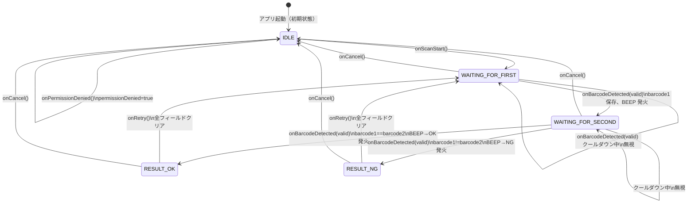

# TESTCASE.md — バーコード照合Androidアプリ テストケース

## テスト方針

| 種別 | 対象 | 実施有無 |
|------|------|---------|
| Unit テスト | ScanViewModel | ✅ 必須 |
| Unit テスト | BarcodeAnalyzer | ❌ 今回対象外（ML Kit / ImageProxy 依存が強いため）|
| Unit テスト | FeedbackSoundPlayer | ❌ 今回対象外（ToneGenerator はモック化困難） |
| 手動確認 | QR_CODE / CODE_39 / CODE_128 読み取り | ✅ 必須 |
| UI テスト（Compose） | 各画面 | ❌ 今回対象外（Q10）|
| Instrumented テスト | CameraX + ML Kit 結合 | ❌ 今回対象外 |

---

## 状態遷移テストマトリクス



---

## TC-VM: ScanViewModel Unit テスト

### 初期状態

| ID | テスト名 | 前提条件 | 操作 | 期待結果 |
|----|---------|---------|------|---------|
| TC-VM-001 | 初期状態の確認 | — | `ScanViewModel()` 生成 | `phase=IDLE`, `barcode1=null`, `barcode2=null`, `result=null`, `errorMessage=null`, `permissionDenied=false` |

---

### フェーズ遷移

| ID | テスト名 | 前提条件 | 操作 | 期待結果 |
|----|---------|---------|------|---------|
| TC-VM-002 | onScanStart() で WAITING_FOR_FIRST へ | `phase=IDLE` | `onScanStart()` | `phase=WAITING_FOR_FIRST` |
| TC-VM-003 | 1つ目有効読み取りで WAITING_FOR_SECOND へ | `phase=WAITING_FOR_FIRST` | `onBarcodeDetected("ABC")` | `barcode1="ABC"`, `phase=WAITING_FOR_SECOND` |
| TC-VM-004 | 2つ目有効読み取りで RESULT へ（一致） | `barcode1="ABC"`, `phase=WAITING_FOR_SECOND` | `onBarcodeDetected("ABC")` | `barcode2="ABC"`, `result=OK`, `phase=RESULT` |
| TC-VM-005 | 2つ目有効読み取りで RESULT へ（不一致） | `barcode1="ABC"`, `phase=WAITING_FOR_SECOND` | `onBarcodeDetected("XYZ")` | `barcode2="XYZ"`, `result=NG`, `phase=RESULT` |
| TC-VM-006 | onRetry() で WAITING_FOR_FIRST へ | `phase=RESULT`, `result=OK` | `onRetry()` | `phase=WAITING_FOR_FIRST`, `barcode1=null`, `barcode2=null`, `result=null` |
| TC-VM-007 | onCancel() で IDLE へ（読み取り中） | `barcode1="ABC"`, `phase=WAITING_FOR_SECOND` | `onCancel()` | `phase=IDLE`, `barcode1=null`, `barcode2=null`, `result=null`, `errorMessage=null` |
| TC-VM-008 | onCancel() で IDLE へ（判定後） | `phase=RESULT`, `result=NG` | `onCancel()` | `phase=IDLE`, 全フィールド null |

---

### クールダウン

| ID | テスト名 | 前提条件 | 操作 | 期待結果 |
|----|---------|---------|------|---------|
| TC-VM-009 | クールダウン中の読み取りを無視 | `phase=WAITING_FOR_FIRST` | `onBarcodeDetected("ABC")` → 即 `onBarcodeDetected("XYZ")` | `barcode1="ABC"`, `phase=WAITING_FOR_SECOND`（2回目は無視） |
| TC-VM-010 | クールダウン終了後は読み取り可 | `phase=WAITING_FOR_FIRST` | `onBarcodeDetected("ABC")` → 1秒後 `onBarcodeDetected("XYZ")` | `barcode2="XYZ"`, `phase=RESULT` |
| TC-VM-011 | 同じ値を意図的に2回読める（クールダウン後） | `phase=WAITING_FOR_FIRST` | `onBarcodeDetected("SAME")` → 1秒後 `onBarcodeDetected("SAME")` | `result=OK` |

---

### 空文字 / null 読み取り

| ID | テスト名 | 前提条件 | 操作 | 期待結果 |
|----|---------|---------|------|---------|
| TC-VM-012 | null 読み取りでフェーズ維持 | `phase=WAITING_FOR_FIRST` | `onBarcodeDetected(null)` | `barcode1=null`, `phase=WAITING_FOR_FIRST`, `errorMessage` が設定される |
| TC-VM-013 | 空文字読み取りでフェーズ維持 | `phase=WAITING_FOR_FIRST` | `onBarcodeDetected("")` | `barcode1=null`, `phase=WAITING_FOR_FIRST`, `errorMessage` が設定される |
| TC-VM-014 | 空白文字列読み取りでフェーズ維持 | `phase=WAITING_FOR_FIRST` | `onBarcodeDetected("   ")` | `barcode1=null`, `phase=WAITING_FOR_FIRST`, `errorMessage` が設定される |
| TC-VM-015 | 2つ目フェーズでの null 読み取りもフェーズ維持 | `barcode1="ABC"`, `phase=WAITING_FOR_SECOND` | `onBarcodeDetected(null)` | `barcode2=null`, `phase=WAITING_FOR_SECOND`, `errorMessage` が設定される |
| TC-VM-016 | 有効読み取りで errorMessage がクリアされる | `errorMessage="読み取りに失敗しました..."` | `onBarcodeDetected("ABC")` | `errorMessage=null` |

---

### SoundEvent 発火

| ID | テスト名 | 前提条件 | 操作 | 期待結果 |
|----|---------|---------|------|---------|
| TC-VM-017 | 1つ目有効読み取りで BEEP 発火 | `phase=WAITING_FOR_FIRST` | `onBarcodeDetected("ABC")` | `SoundEvent.BEEP` が emit される |
| TC-VM-018 | OK判定で BEEP → OK の順で発火 | `barcode1="ABC"`, `phase=WAITING_FOR_SECOND` | `onBarcodeDetected("ABC")` | `SoundEvent.BEEP` → `SoundEvent.OK` の順で emit される |
| TC-VM-019 | NG判定で BEEP → NG の順で発火 | `barcode1="ABC"`, `phase=WAITING_FOR_SECOND` | `onBarcodeDetected("XYZ")` | `SoundEvent.BEEP` → `SoundEvent.NG` の順で emit される |
| TC-VM-020 | null 読み取りで SoundEvent を発火しない | `phase=WAITING_FOR_FIRST` | `onBarcodeDetected(null)` | `SoundEvent` が emit されない |

---

### 権限・IDLE 状態での入力ガード

| ID | テスト名 | 前提条件 | 操作 | 期待結果 |
|----|---------|---------|------|---------|
| TC-VM-021 | onPermissionDenied() で permissionDenied=true | — | `onPermissionDenied()` | `permissionDenied=true`, `phase=IDLE` |
| TC-VM-022 | IDLE 中の onBarcodeDetected は無視 | `phase=IDLE` | `onBarcodeDetected("ABC")` | `phase=IDLE`, `barcode1=null`（変化なし） |
| TC-VM-023 | RESULT 中の onBarcodeDetected は無視 | `phase=RESULT` | `onBarcodeDetected("ABC")` | `phase=RESULT`（変化なし） |

---

## TC-ST: 状態遷移の網羅テスト

`ScanViewModel` の状態遷移を一覧で確認するテスト。

| 現在フェーズ | イベント | 期待フェーズ | 備考 |
|-------------|---------|------------|------|
| IDLE | `onScanStart()` | WAITING_FOR_FIRST | — |
| IDLE | `onBarcodeDetected(valid)` | IDLE | 無視 |
| IDLE | `onCancel()` | IDLE | 変化なし |
| IDLE | `onPermissionDenied()` | IDLE | permissionDenied=true |
| WAITING_FOR_FIRST | `onBarcodeDetected(valid)` | WAITING_FOR_SECOND | barcode1 保存 |
| WAITING_FOR_FIRST | `onBarcodeDetected(null)` | WAITING_FOR_FIRST | errorMessage 設定 |
| WAITING_FOR_FIRST | `onBarcodeDetected(valid)` クールダウン中 | WAITING_FOR_FIRST | 無視 |
| WAITING_FOR_FIRST | `onCancel()` | IDLE | 全クリア |
| WAITING_FOR_SECOND | `onBarcodeDetected(valid)` 一致 | RESULT | result=OK |
| WAITING_FOR_SECOND | `onBarcodeDetected(valid)` 不一致 | RESULT | result=NG |
| WAITING_FOR_SECOND | `onBarcodeDetected(null)` | WAITING_FOR_SECOND | errorMessage 設定 |
| WAITING_FOR_SECOND | `onBarcodeDetected(valid)` クールダウン中 | WAITING_FOR_SECOND | 無視 |
| WAITING_FOR_SECOND | `onCancel()` | IDLE | 全クリア |
| RESULT | `onRetry()` | WAITING_FOR_FIRST | 全クリア |
| RESULT | `onCancel()` | IDLE | 全クリア |
| RESULT | `onBarcodeDetected(valid)` | RESULT | 無視 |

---

## テスト実装メモ

### セットアップ：MainDispatcherRule

`ScanViewModel` は `viewModelScope` + `delay(1000L)` でクールダウンを実装する。  
Unit テストでは `MainDispatcherRule` で `Dispatchers.Main` を `StandardTestDispatcher` に差し替え、`advanceTimeBy` で時間を操作する。  
`ScanViewModel` 本体にテスト用 `CoroutineDispatcher` 引数は追加しない。

```kotlin
@OptIn(ExperimentalCoroutinesApi::class)
class MainDispatcherRule(
    val testDispatcher: TestDispatcher = StandardTestDispatcher()
) : TestWatcher() {
    override fun starting(description: Description) {
        Dispatchers.setMain(testDispatcher)
    }
    override fun finished(description: Description) {
        Dispatchers.resetMain()
    }
}
```

### クールダウンのテスト

```kotlin
@OptIn(ExperimentalCoroutinesApi::class)
class ScanViewModelTest {

    @get:Rule
    val mainDispatcherRule = MainDispatcherRule()

    @Test
    fun cooldown_ignoresScanWithin1Second() = runTest {
        val vm = ScanViewModel()
        vm.onScanStart()
        vm.onBarcodeDetected("ABC")
        vm.onBarcodeDetected("XYZ") // クールダウン中 → 無視
        assertEquals(ScanPhase.WAITING_FOR_SECOND, vm.state.value.phase)
        assertEquals("ABC", vm.state.value.barcode1)
    }

    @Test
    fun cooldown_acceptsScanAfter1Second() = runTest {
        val vm = ScanViewModel()
        vm.onScanStart()
        vm.onBarcodeDetected("ABC")
        advanceTimeBy(1001L)
        runCurrent()
        vm.onBarcodeDetected("XYZ")
        assertEquals(ScanPhase.RESULT, vm.state.value.phase)
        assertEquals("XYZ", vm.state.value.barcode2)
    }
}
```

### SoundEvent の収集方法

```kotlin
@Test
fun okScan_emitsBeepThenOk() = runTest {
    val vm = ScanViewModel()
    val events = mutableListOf<SoundEvent>()
    val job = launch { vm.soundEvent.collect { events.add(it) } }

    vm.onScanStart()
    vm.onBarcodeDetected("ABC")
    advanceTimeBy(1001L)
    runCurrent()
    vm.onBarcodeDetected("ABC")

    assertEquals(listOf(SoundEvent.BEEP, SoundEvent.BEEP, SoundEvent.OK), events)
    job.cancel()
}
```

---

## 受け入れ条件との対応

| 受け入れ条件（spec.md §16） | 対応テストケース |
|---------------------------|----------------|
| APKでインストールできる | 手動確認（`assembleDebug`） |
| スタートボタンでカメラ起動 | 手動確認 |
| 1つ目のバーコードを読み取れる | TC-VM-003 |
| 2つ目のバーコードを読み取れる | TC-VM-004, TC-VM-005 |
| 2つの値を画面に表示できる | 手動確認（ResultScreen） |
| 一致時に青色でOK表示 | TC-VM-004 + 手動確認 |
| 不一致時に赤色でNG表示 | TC-VM-005 + 手動確認 |
| 読み取り時に音が鳴る | TC-VM-017, TC-VM-018, TC-VM-019 |
| 判定時にOK/NG音が鳴る | TC-VM-018, TC-VM-019 |
| 「もう一度」で再実行できる | TC-VM-006 |
| QR_CODE / CODE_39 / CODE_128 を読み取れる | 実機手動確認 |
