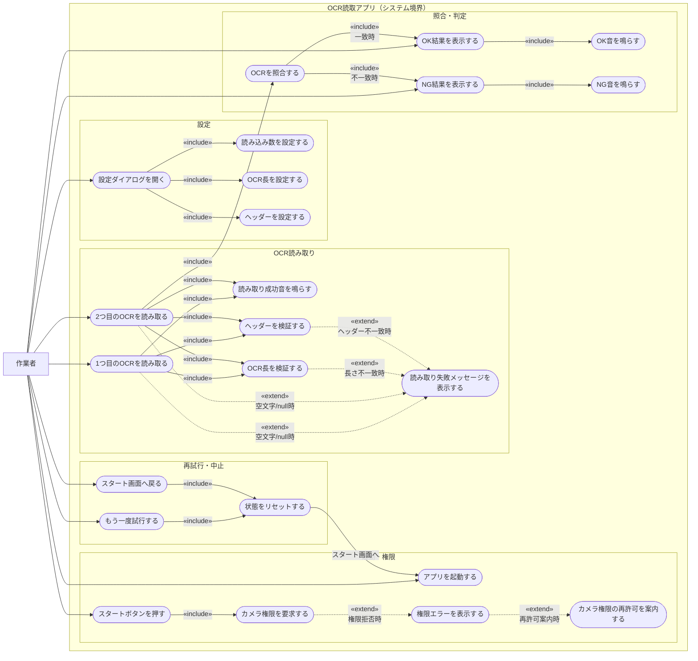
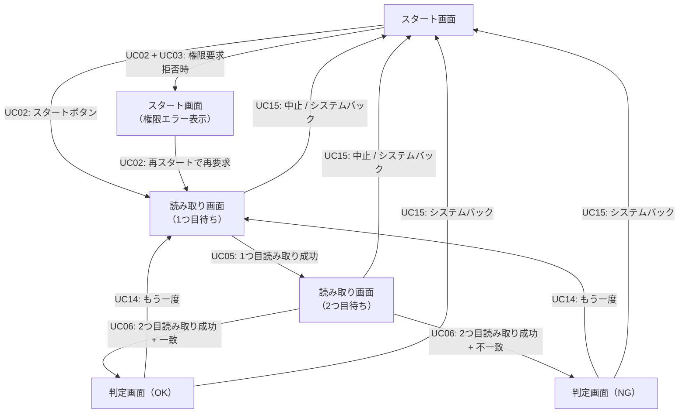

# USECASE.md — OCR読取Androidアプリ ユースケース図

## アクター

| アクター | 説明 |
|----------|------|
| 作業者 | アプリを操作する現場担当者 |

---

## ユースケース図

---

## ユースケース一覧

### 起動・権限

| ID | ユースケース | 概要 |
|----|-------------|------|
| UC01 | アプリを起動する | スタート画面を表示する |
| UC02 | スタートボタンを押す | カメラ画面へ遷移する |
| UC03 | カメラ権限を要求する | OS の権限ダイアログを表示する |
| UC04 | 権限エラーを表示する | 権限拒否時にスタート画面へエラーメッセージを表示する |
| UC17 | カメラ権限の再許可を案内する | 権限拒否後、再スタートまたは設定画面での許可を案内する |

### OCR読み取り

| ID | ユースケース | 概要 |
|----|-------------|------|
| UC05 | 1つ目のOCRを読み取る | カメラで1回目のスキャンを行う。読取後1秒はクールダウン |
| UC06 | 2つ目のOCRを読み取る | カメラで2回目のスキャンを行う。読取後1秒はクールダウン |
| UC07 | 読み取り成功音を鳴らす | ToneGenerator で TONE_PROP_BEEP を再生する |
| UC08 | 読み取り失敗メッセージを表示する | 空文字/null 読み取り・バリデーションエラー時に画面内メッセージを表示する。次の有効読み取りでクリア |
| UC18 | OCR長を検証する | 設定長が 0 以外のとき、読み取り値の長さと照合する。不一致なら「OCR長が違います（読んだ長さ = x）」を表示 |
| UC19 | ヘッダーを検証する | 設定ヘッダーが空でないとき、読み取り値の先頭文字列と照合する。不一致なら「ヘッダーが一致しません」を表示 |

### 照合・判定

| ID | ユースケース | 概要 |
|----|-------------|------|
| UC09 | 2件のOCRを照合する | ocr1 と ocr2 が揃った後に ocr1 == ocr2 を判定する |
| UC10 | OK結果を表示する | 一致時に青背景で「OK」を大表示する |
| UC11 | NG結果を表示する | 不一致時に赤背景で「NG」を大表示する |
| UC12 | OK音を鳴らす | ToneGenerator で TONE_PROP_ACK を再生する |
| UC13 | NG音を鳴らす | ToneGenerator で TONE_PROP_NACK を再生する |

### 設定

| ID | ユースケース | 概要 |
|----|-------------|------|
| UC20 | 設定ダイアログを開く | スタート画面の「設定」ボタンで3項目設定ダイアログを表示する |
| UC21 | 読み込み数を設定する | 目標件数を入力し SharedPreferences に保存する。0 はスタートを無効化 |
| UC22 | OCR長を設定する | 読み取り値の桁数制限を設定する。0 は任意の長さを許可 |
| UC23 | ヘッダーを設定する | OCR先頭の必須文字列を設定する。空欄はチェックなし |

### 再試行・中止

| ID | ユースケース | 概要 |
|----|-------------|------|
| UC14 | もう一度試行する | 判定画面の「もう一度」ボタンで1つ目読み取りへ戻る |
| UC15 | スタート画面へ戻る | 読み取り画面の「中止」ボタン、または読み取り画面・判定画面のシステムバックで状態をリセットし、スタート画面へ戻る |
| UC16 | 状態をリセットする | ocr1 / ocr2 / 判定結果 / エラーメッセージをクリアする |

---

## 画面遷移との対応

